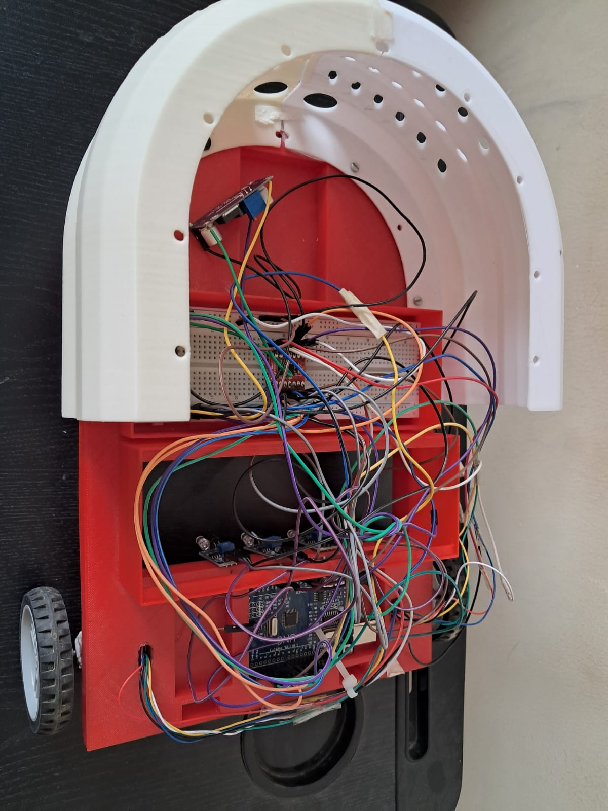
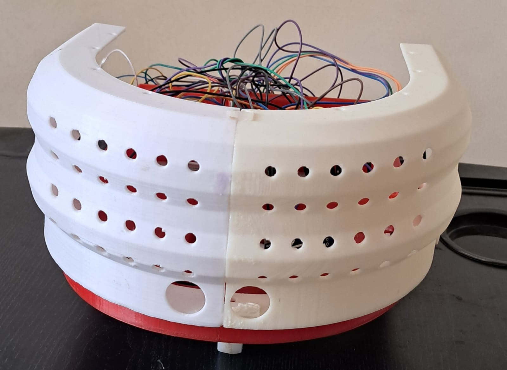
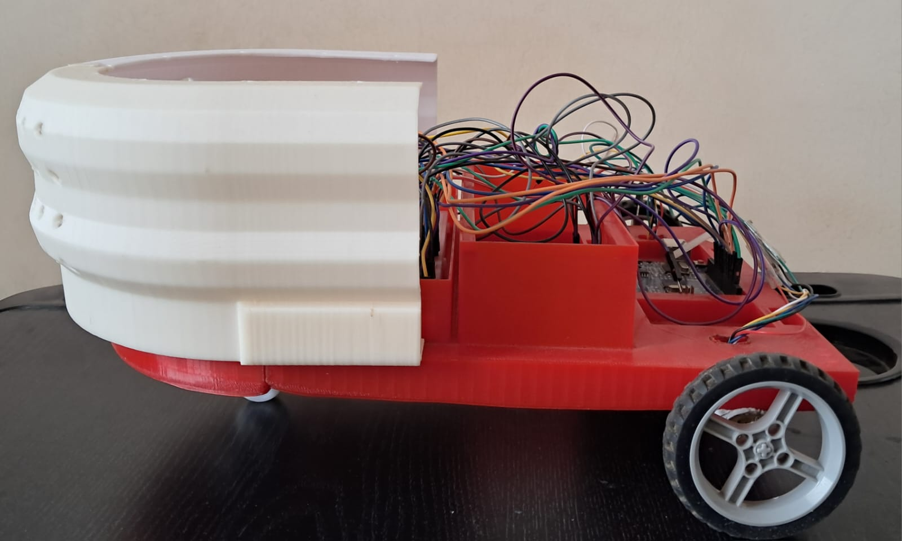

# Autonomous Guided Vehicle (AGV)

> A real-world implementation of an Autonomous Guided Vehicle (AGV) using embedded systems and control algorithms.

---

## Overview
This project focuses on designing and developing an Autonomous Guided Vehicle (AGV) for indoor navigation using embedded systems, sensors, and control algorithms.

The system is built to operate in real-world conditions, handling challenges such as sensor noise, motor inconsistencies, and mechanical instability. The goal is to achieve stable, reliable, and scalable autonomous navigation.

---

## Features
- Line following using IR sensors  
- PID-based control for trajectory stability  
- PWM-based motor control using TB6612 motor driver  
- Real-time sensor calibration and tuning  
- Differential drive kinematics implementation  
- Basic obstacle detection using ultrasonic sensors  
- Modular design for future extensions (QR-based navigation, path planning)

---

## Tech Stack
- **Hardware:** ESP32, Arduino, TB6612 Motor Driver, IR Sensors, Ultrasonic Sensors  
- **Programming:** C/C++  
- **Concepts:** Embedded Systems, Control Systems (PID), Robotics Basics  

---

## Demo Videos
Drive Link:  
👉 https://drive.google.com/drive/folders/1rGZkzHw1u9BMaE4qZg73k8P14K_iCs07?usp=drive_link  

### Demonstrations include:
- Line-following using IR sensors  
- PID tuning and stability improvements  
- Real-world testing on different tracks  

---

## Images

### AGV Prototype

---

## System Architecture
- Sensor input (IR sensors, ultrasonic sensors)  
- Control layer (PID controller for trajectory correction)  
- Actuation layer (motor driver + PWM control)  
- Feedback loop for continuous adjustment  

---

## Challenges & Learning
- Handling noisy sensor data and calibration issues  
- Tuning PID parameters to reduce oscillations  
- Dealing with hardware imperfections (wheel imbalance, friction)  
- Understanding real-world vs theoretical system behavior  
- Debugging embedded systems under constraints  

---

## Future Improvements
- QR-code based localization  
- Graph-based path planning (Dijkstra / A*)  
- Camera-based perception using computer vision  
- ROS2 integration for scalable navigation  
- Sensor fusion for improved accuracy  

---

## Project Insights
This project provided hands-on experience in building a complete robotic system from scratch, integrating hardware, control algorithms, and real-world testing.

It strengthened my understanding of how sensor data, control logic, and mechanical design interact to influence system performance.

---

## Status
🚧 Ongoing project — actively improving performance and adding advanced features
